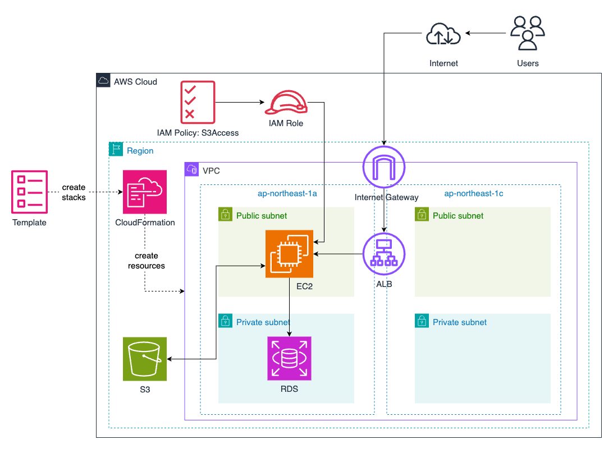

# RaiseTech AWSコース　学習状況
## 概要
- 2024年4月下旬より受講を開始しました。
- 全16回の講義から構成されるためまだ学習継続中ですが、現時点(2024/08/21)で完了した項目についてまとめます。
### ◆ 実施内容
- EC2上でサンプルアプリケーション（Ruby on Rails）をデプロイ  
　− WebサーバーとしてNginx，アプリケーションサーバーとしてPumaを使用  
　− ELB（ALB），S3を追加  
- CloudFormationを用いて上記インフラ環境およびリソースを構築  
### ◆ 現時点でのインフラ構成図

### ◆ 学習記録
| No. | 内容 | 課題 | レポート |  
| :---: | :--- | :--- | :---: |
| 1 | **導入** ・AWS，クラウド技術について ・インフラエンジニアとは |・AWSアカウントを作成 ・IAMの推奨設定 （MFA,Billing,AdministratorAccess) ・Cloud9の作成 | Discord上で提出 反映なし |
| 2 | **バージョン管理システム** ・Gitの基本理解 ・GitHub TIPS & PR作成デモ | ・GitHubアカウント作成 ・Cloud9にてGit設定変更 ・GitHubにて学習報告をPR （Markdown形式とPRの練習） | [lecture02.md](lecture02.md) |    
| 3 | **Webアプリケーションとは** ・システム開発の流れ ・外部ライブラリと構成管理 | ・Cloud9上でサンプルアプリケーションを起動 ・課題で学習したことを記述 | [lecture03.md](lecture03.md) |  
| 4 | **AWS上での環境構築** ・AWSでの権限管理 ・VPC，サブネット構築について ・EC2インスタンス，RDSの作成 |・VPC, EC2, RDS を作成 ・EC2 から RDS へ接続 | [lecture04.md](lecture04.md) |  
| 5 | **AWS上でアプリケーションを手動デプロイ** ・EC2でのアプリケーション起動 ・ELB（冗長化・負荷分散） ・S3について ・インフラ構成図 | ・EC2に手動でサンプルアプリケーションをデプロイ （Webサーバー(Nginx)，APサーバー(Puma)使用） ・ELB(ALB)，S3を追加 ・draw.io を用い構成図を作成 | [lecture05.md](lecture05.md) |  
| 6 | **安定稼働のために** ・システムの安定稼働の重要性 ・AWSでの証跡，ロギング ・AWSでの監視，通知 ・AWSでのコスト管理 | ・CloudTrailで証跡を見る ・CloudWatchアラーム、SNSを使用しメール通知する ・AWS利用料の見積作成（AWS Pricing Calculator） ・現状のEC2利用料を確認 | [lecture06.md](lecture06.md) |  
| 7 | **セキュリティ** ・システムにおけるセキュリティの基礎 ・AWSでのセキュリティ対策 （脆弱性，人為的な過負荷など） | - | - |  
| 8 | 第5回課題内容の実演（1） | - | - |  
| 9 | 第5回課題内容の実演（2） | - | - |  
| 10 | **環境構築をコード化** ・インフラの自動化について ・CloudFormation  | CloudFormationを使用し、 これまでの環境をコード化する | [lecture10.md](lecture10.md) |  
| 11〜16 | 下記「学習中の内容」 | − | - |  　

### 　◆ 学習中の内容
- Ansibleの活用‥サンプルアプリケーションの実行環境を自動構築する。
- ServerSpecの活用‥構築したサーバーのテストを自動化する。
- CircleCIを用いてCI/CD環境を構築‥上記プロセスのパイプラインを構築し自動化する。